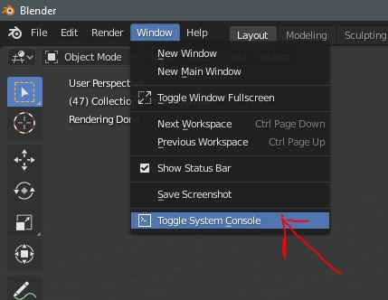
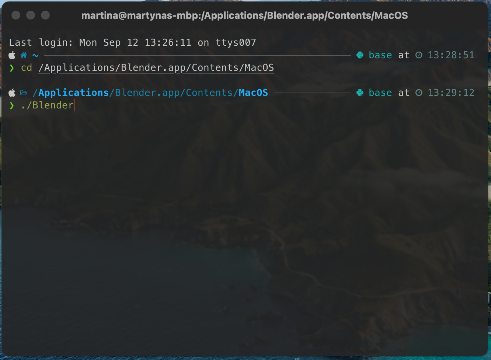
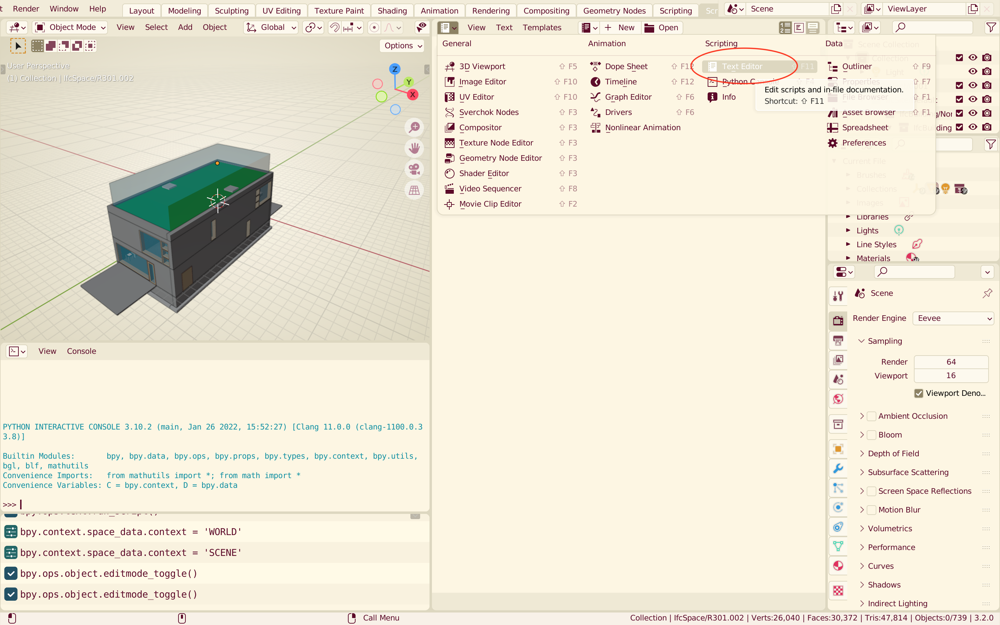
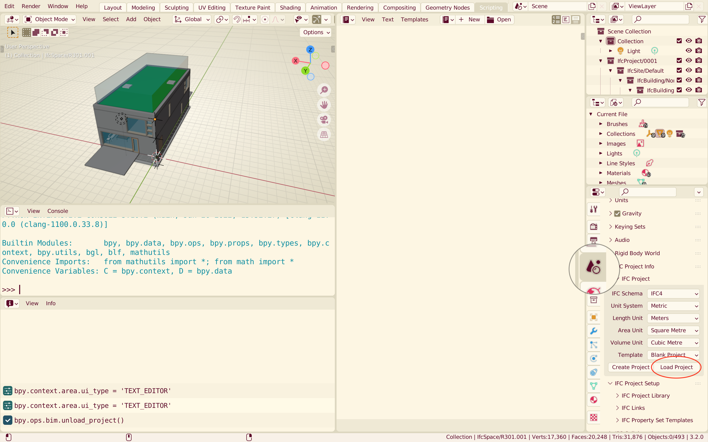
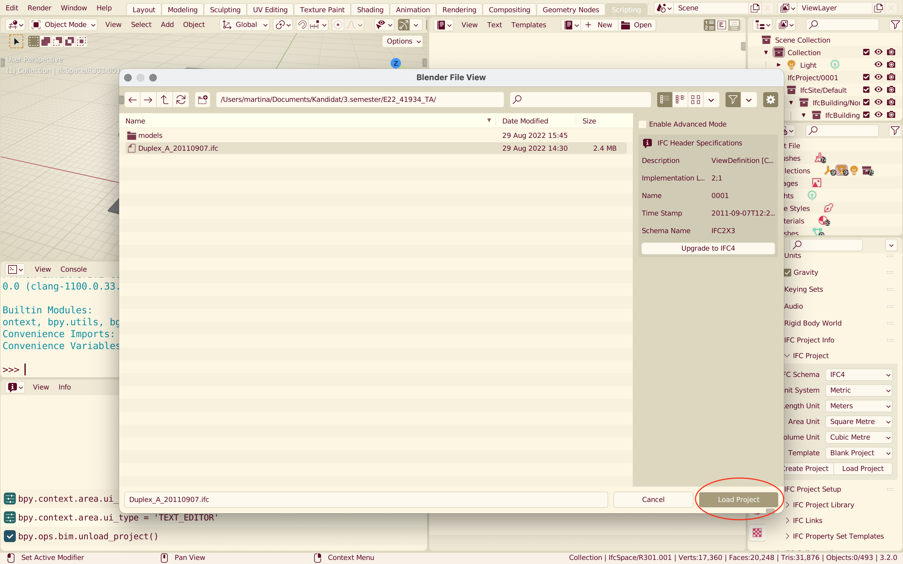
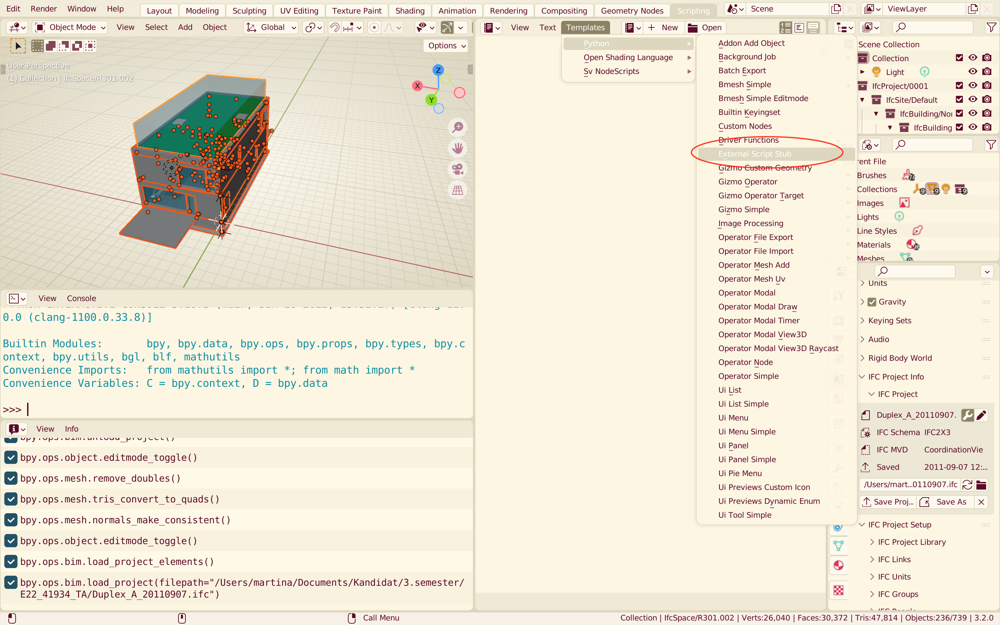
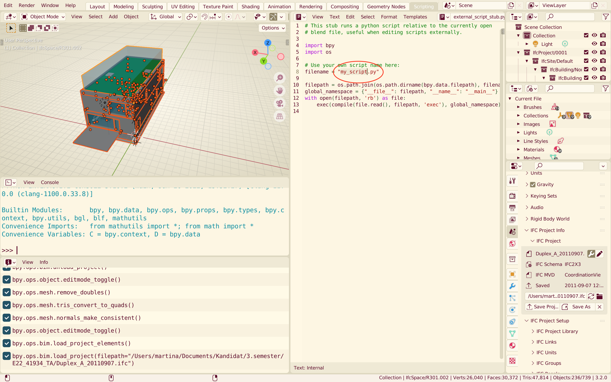
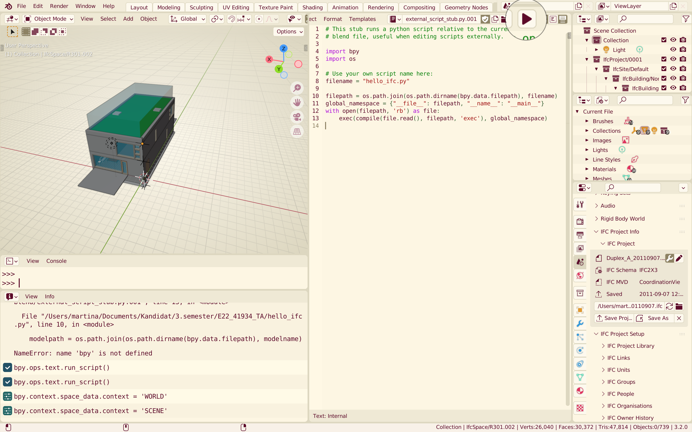
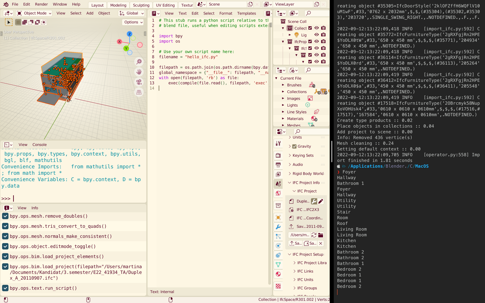

# How to run an external script in Blender
## To view outputs of your file
The outputs (eg. print statements) of your file won't show in the Blender console. They are output to the system console (your computers terminal/command prompt).
### Windows
On Windows you can open the system console by simply clicking "Window -> Toggle System Console"


### MacOS/Linux
On MacOS or Linux systems you have to run Blender from the terminal to be able to see outputs.

- Open your terminal and navigate to Blender location. This will typically be at `/Applications/Blender.app/Contents/MacOS`
- Go to this location with the command `cd` (change directory) as:
	`cd /Applications/Blender.app/Contents/MacOS`
- Run Blender by typing:
	`./Blender`
	Blender will open up as normally. Now, whenever you run your script, the outputs will be shown here.


## Running an external script
### Open Blender (either normally or through a terminal) and make a new 'text' window.


### (A) If you want to use the IFC model through in Blender
#### Load it with BlenderBIM




#### Test file
- Make a new `hello_ifc.py` file and place it in the same directory as your blender file.

```python
# IF YOU'RE USING THE IFC MODEL LOADED IN BLENDER
from blenderbim.bim.ifc import IfcStore

file = IfcStore.get_file()
spaces = file.by_type("IfcSpace")

for space in spaces:
	print(space.LongName)
```

### (B) If you want to use another, external IFC model 
- Place both the IFC model  and a new `hello_ifc.py` in the same directory as your blender file
#### Test file
```python
# IF YOU'RE ANOTHER, EXTERNAL IFC MODEL
import ifcopenshell
import bpy
import os


modelname = "Duplex_A_20110907.ifc"
modelpath = os.path.join(os.path.dirname(bpy.data.filepath), modelname)
file = ifcopenshell.open(modelpath)

spaces = file.by_type("IfcSpace")

for space in spaces:
	print(space.LongName)
```

### Open template for external scripts

### Change filename to your file name (eg. "hello_ifc.py")

### Run your script

Your system console should be showing a list of space names.

