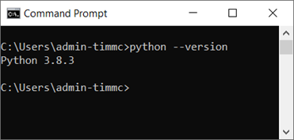
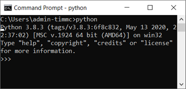
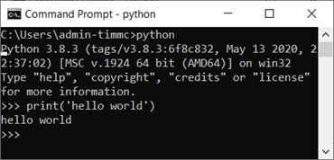
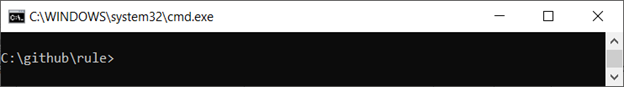
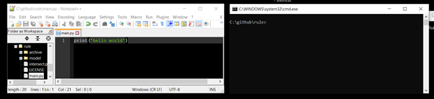
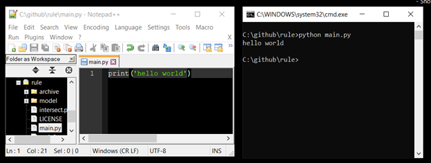
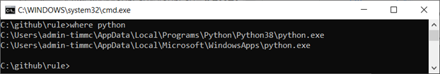

# IfcOpenShell Setup with Python (WIP)

This guide supports you to:
*  Setup python on your machine / check if it is installed correctly
*  Run your first python program.
*  setup ifcopenshell
* run an example to test it

> Extensions: in future we want to make instruction for doing this on a mac too.

## Step 1.	 Python version / install check
Go to the command line in windows or the Terminal in mac and type:
> python --version

This should tell you the version of python that you are using. For instance you can see here that I am using 3.8.3.



> N.B. At the time of writing this, if using windows when typing python into the command line if you don't have it, windows will offer to get if for you from the store, please DO NOT accept this. It is much better to download it yourself from the link above, please also make note of the version you are using as we will need to  get a matching version of ifcOpenShell later in this tutorial.

## Step 2:  Jump into and out of python from the command line / terminal (optional)
You can see that this time I have typed 

> python



And it has given me the python interpreter >>> 
I can now type python commands into this and it will give me an output. for instance:

> print(‘hello world’)

Produces the result



> \>\>\> hello world

To exit the python interpreter type: 

> exit()

So now you shouldn’t be able to see the >>> prompt and it should instead be something more like:

> C:/USER/MY_USER_NAME>

or the equivalent on your machine.

## Step 3: Run your first python program.
It is a bit annoying to have to write out each line separately into the python interpreter, to get around this we can write a python script in a text editor and then save this a .py file. 
So first we set up a location for your program. I am using c:/github as a root location on my machine, it is up to you where you choose, but it should be somewhere easy to find.

### Step 3.1  creating a .bat file to get to your location (optional)
This is an optional step, but I find it makes it easier - I don’t have a mac equivalent yet, and it is not an essential step. so create a new file on your desktop and rename it to [name of the program].bat for instance mine is called rule.bat.	
Open that file in a text editor for instance notepad++ or sublime and copy in the following. 

> @ECHO OFF
> cmd.exe /K "cd C:\github\rule && c:"

Save it and then when you double click it on your desktop it will automatically open the cmd line in the right place. Please note that the bat file uses backslashes.



Ok so now we have set that up go to the program folder (in our case c:/github/rule). In that folder create a new file called main.py. Open up that folder in a text editor (notepad++ for instance) and in the file type:

> print (‘hello world’)

Now save the file - you can keep the text editor open so that you have the text editor and cmd line side by side for instance…



### Step 3.2
Ok now, type into the cmd line

> python main.py

This will run your program and you will see the result in the command line.



Cool eh? you just wrote and ran your first proper program in Python - good job!

## Step 4 'install' IfcOpenShell 
Having worked out what version of Python you have in step 1 we now need to work out where it is installed so that we can add the ifcOpenShell folder from
(http://ifcopenshell.org/python) - please be careful about the python version number to ensure compatibility.

On a windows machine I will type … 

> where python

on a mac I can type: 

> which python

into Terminal which should give a similar result. On my machine it says two places, I chose the first one.



So I will go to:

> C:\Users\XXXX-XXXX\AppData\Local\Programs\Python\Python38\

n.b your location will not be XXXX-XXXX - this is an example!
and from there I will open the Lib/site-packages so I end up at 

> C:\Users\admin-timmc\AppData\Local\Programs\Python\Python38\Lib\site-packages

The downloaded ifcopenshell folder should go in there.


## Step 5: Test your setup:
Open up your program folder for me it was (c:/github/rule), but this could be anywhere for you. In the text editor open up the main.py file in your folder. Now in that folder type the following
```python
import ifcopenshell
model = ifcopenshell.open('model\Duplex_A_20110907.ifc')
for obj in model.by_type('IfcSlab'):
	print(obj.Name)
```
Save that and then run it from the command line following Step 3.2 if this works, have a go at some of the code examples in the code examples folder **[make this a link]**.


